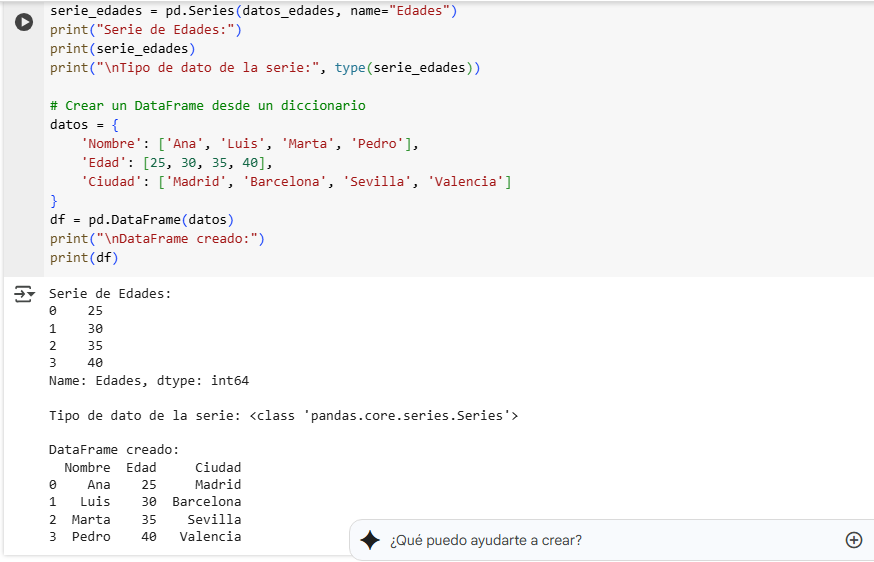
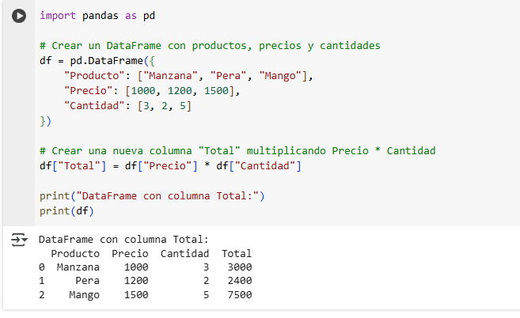

# Ejemplos de Pandas: DataFrames y Series
## **Introducción**
Pandas es una biblioteca fundamental de Python para la manipulación y análisis de datos. Proporciona dos estructuras de datos principales: **Series** (arreglos unidimensionales) y **DataFrames** (estructuras bidimensionales tipo tablas).

## Ejemplo 1: Creación de Series y DataFrames desde diccionarios

### **Código en Python:**
```python
import pandas as pd

# Crear una Serie a partir de una lista
datos_edades = [25, 30, 35, 40]
serie_edades = pd.Series(datos_edades, name="Edades")
print("Serie de Edades:")
print(serie_edades)
print("\nTipo de dato de la serie:", type(serie_edades))

# Crear un DataFrame desde un diccionario
datos = {
    'Nombre': ['Ana', 'Luis', 'Marta', 'Pedro'],
    'Edad': [25, 30, 35, 40],
    'Ciudad': ['Madrid', 'Barcelona', 'Sevilla', 'Valencia']
}
df = pd.DataFrame(datos)
print("\nDataFrame creado:")
print(df)
```

### Resultado
```
Serie de Edades:
0    25
1    30
2    35
3    40
Name: Edades, dtype: int64

Tipo de dato de la serie: <class 'pandas.core.series.Series'>

DataFrame creado:
  Nombre  Edad     Ciudad
0    Ana    25     Madrid
1   Luis    30  Barcelona
2  Marta    35    Sevilla
3  Pedro    40   Valencia
```
---

## Ejemplo 2: Operaciones con columnas en un DataFrame

### Código en Python:
```python
import pandas as pd

# Crear un DataFrame con productos, precios y cantidades
df = pd.DataFrame({
    "Producto": ["Manzana", "Pera", "Mango"],
    "Precio": [1000, 1200, 1500],
    "Cantidad": [3, 2, 5]
})

# Crear una nueva columna "Total" multiplicando Precio * Cantidad
df["Total"] = df["Precio"] * df["Cantidad"]

print("DataFrame con columna Total:")
print(df)
```
### Resultado
```
DataFrame con columna Total:
  Producto  Precio  Cantidad  Total
0  Manzana    1000         3   3000
1     Pera    1200         2   2400
2    Mango    1500         5   7500
```
---
## Ejemplo con pantallazo

Aquí vemos el resultado de la ejecución:



